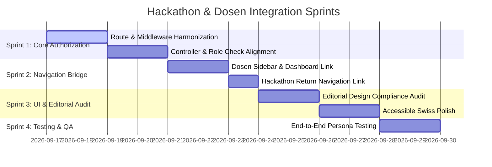

# Hackathon Implementation Plan & Sprint Phases

## Overview
This document outlines the architectural strategy and sprint phases to resolve the dashboard collision between the existing **Directorate Dosen Portal** and the unified **Hackathon Portal**, adhering to the **Accessible Swiss International** design system (`editorial-design.rules.md`).

---

## Architecture: Hub & Program Portal Pattern

### Problem Statement
- **Dosen Persona**: Has access to 10+ Directorate services (Katsinov V2, Equity, APC, Hibah Modul, etc.) rendered in the primary teal/sidebar theme.
- **Hackathon Persona**: Dedicated participant/collaborator roles (`hackaton_dosen`, `hackaton_mahasiswa`, `hackaton_alumni`, `reviewer_hackaton`, etc.) accessing a unified role-based portal built with Accessible Swiss International design.
- **Collision Risk**: Duplicating views or forcing one styling onto the other creates maintenance overhead and design inconsistencies (as previously experienced in `inovchalenge`).

### Solution Summary
- **Authentication & Redirection**: Keep `dosen` / `tendik` redirecting to their master hub dashboard; keep `hackaton_*` roles landing directly on `/hackathon/dashboard`.
- **Shared Access**: Allow native `dosen` and `tendik` users to access the unified Hackathon portal seamlessly with full Pengusul privileges.
- **Navigation Bridge**: Add a clear entry point in Dosen sidebar/dashboard, and a "Kembali ke Portal Dosen" return action in the Hackathon navbar.

---

## Sprint Roadmap & Phases

---

### Sprint 1: Route & Permission Harmonization
**Goal**: Ensure native `dosen` and `tendik` users can access `/hackathon/*` routes and perform all Pengusul actions without 403 Forbidden errors or duplicate route files.

- [x] **Task 1.1 — Update Route Middleware (`routes/hackaton.php`)**:
  - Added `dosen` and `tendik` to the `$allParticipantAndReviewerRoles` list.
  - Added `dosen` and `tendik` to the Pengusul middleware group (`role:hackaton_dosen,hackaton_tendik,dosen,tendik`).
- [x] **Task 1.2 — Update Controllers**:
  - In `ParticipantDashboardController.php`, ensured `isPengusul`, `ROLE_LABELS`, and `ROLE_ICONS` support `dosen` and `tendik`.
  - `PengusulController.php` and `MemberController.php` support submission and member invitations for both role conventions (`dosen` and `hackaton_dosen`).
- [x] **Task 1.3 — Maintain Login Redirection (`LoginController.php`)**:
  - Kept `dosen` redirecting to `subdirektorat-inovasi.dosen.dashboard`.
  - Kept `hackaton_*` roles redirecting to `hackaton.dashboard`.

---

### Sprint 2: Portal Cross-Bridge & Navigation
**Goal**: Enable smooth navigation between the Master Dosen Portal and the Unified Hackathon Portal.

- [x] **Task 2.1 — Dosen Sidebar Navigation**:
  - Added dedicated **Hackathon UNJ** accordion menu in `resources/views/subdirektorat-inovasi/dosen/sidebar.blade.php`.
  - Linked to `route('hackaton.dashboard')`, `route('hackaton.sessions.index')`, and `route('hackaton.submissions.index')`.
- [x] **Task 2.2 — Dosen Dashboard Widget**:
  - Added Hackathon UNJ to `$cardConfig` and counted submissions in `app/Http/Controllers/Dosen/DashboardController.php`.
- [x] **Task 2.3 — Hackathon Return Bridge**:
  - In `resources/views/subdirektorat-inovasi/hackaton/navbar.blade.php` and `sidebar.blade.php`, added a high-contrast **"← Kembali ke Portal Utama"** button when user role is `dosen` or `tendik`.

---

### Sprint 3: UI & Editorial Design Alignment
**Goal**: Enforce strict adherence to `docs/hackaton/editorial-design.rules.md` across all Hackathon views.

- [ ] **Task 3.1 — Accessibility & Contrast Check**:
  - Strict light mode verification (pure `#FFFFFF` or `#F8F9FA` backgrounds).
  - High-contrast typography with massive, heavy headings (`text-4xl` to `text-6xl`, `font-black`).
- [ ] **Task 3.2 — Blocky Components & Anti-Slop Audit**:
  - Ensure all primary buttons use blocky rectangles with 0px or 4px border radius.
  - Zero gradients, zero glassmorphism, and zero hover-only information.
  - Single high-visibility accent color (UNJ Green / Cobalt Blue) strictly for primary Call-to-Actions.

---

### Sprint 4: Testing & Quality Assurance
**Goal**: Validate full user journeys across all participant and evaluator roles.

- [ ] **Task 4.1 — Dosen User Journey Testing**:
  - Log in as `dosen` $\rightarrow$ Enter Dosen Dashboard $\rightarrow$ Click Hackathon $\rightarrow$ View Hackathon Dashboard with Swiss styling.
  - Create submission as Ketua Tim, invite members, complete stage forms $\rightarrow$ Return to Dosen Portal.
- [ ] **Task 4.2 — Dedicated Hackathon Participant Testing**:
  - Log in as `hackaton_mahasiswa` / `hackaton_alumni` $\rightarrow$ Confirm direct landing on `hackaton.dashboard` and verify isolation from Dosen portal routes.
- [ ] **Task 4.3 — Reviewer & Admin Testing**:
  - Test assignment flow, stage scoring, and status progression across both reviewer roles (`reviewer_hackaton`, `reviewer_inovchalenge`).
